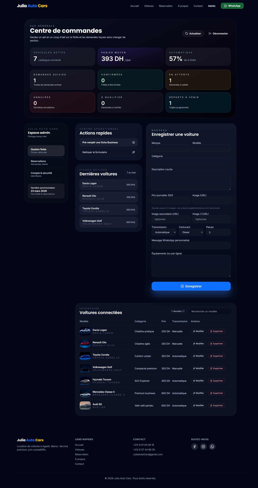

# Julia Rental App – Frontend

React + Vite frontend for the Julia Auto Cars rental platform. It delivers a marketing site, customer reservation flow, and an authenticated admin dashboard that speaks to the Spring Boot backend.

## Tech stack
- Vite, React 18, TypeScript
- Tailwind CSS, Shadcn/ui primitives, custom animations
- React Router, Context API, hooks-based state
- i18next-powered translations (EN/ES/FR)

## Getting started
1. **Install deps** – `npm install` (or `bun install`).
2. **Configure env** – copy `.env.example` to `.env` and fill API base URLs plus auth secrets.
3. **Run locally** – `npm run dev` (or `bun run dev`); the app expects the backend at `http://localhost:8080` by default.
4. **Run tests** – `npm run test` for Vitest + Testing Library coverage.

## Project structure
- `src/pages` – top-level routes (marketing pages, auth, admin dashboard).
- `src/components` – shared UI (Hero, ReservationSteps, ProtectedRoute, etc.).
- `src/contexts` – `AuthContext` and `CarInventoryContext` providers.
- `src/lib` – API client, contact info, shared helpers.
- `src/locales` – translation bundles for English, Spanish, and French.

## Screenshot

Pair this frontend with the Spring Boot backend in `rental_app_backend` for a fully functional rental experience.
